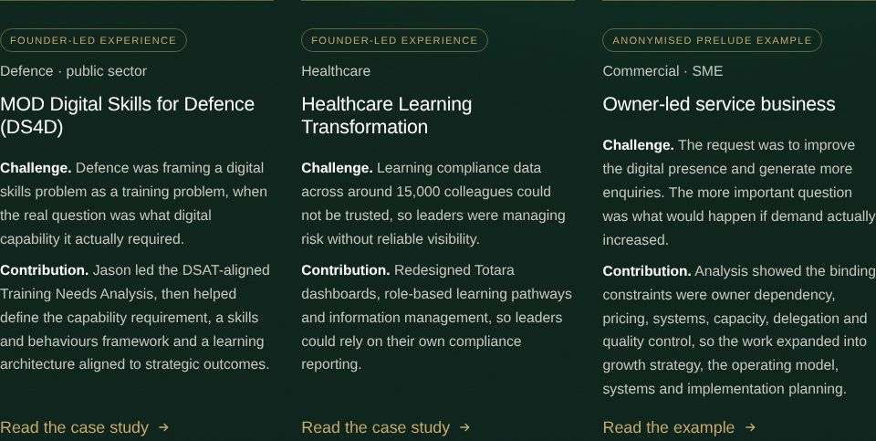
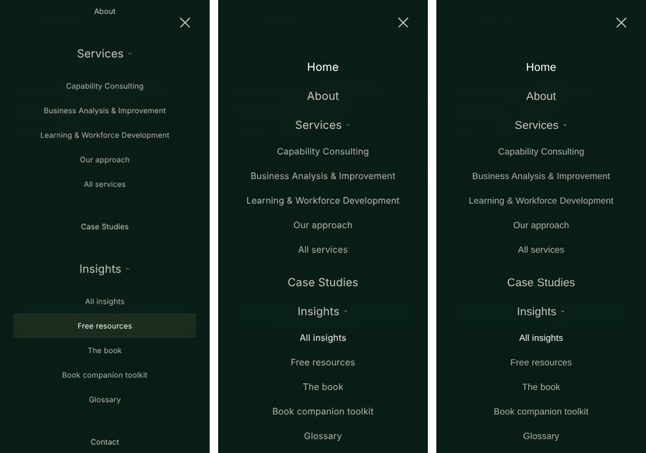
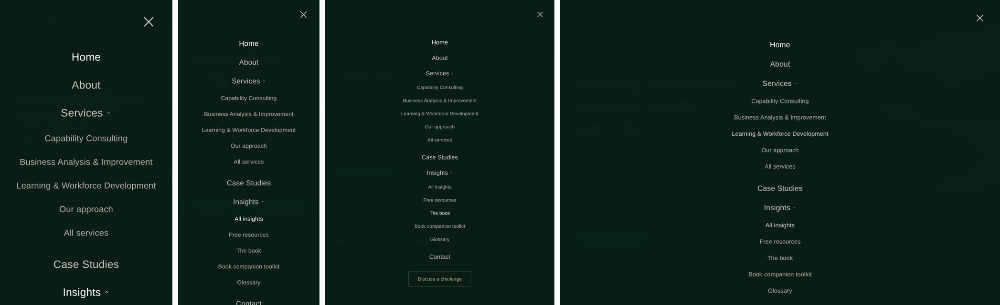
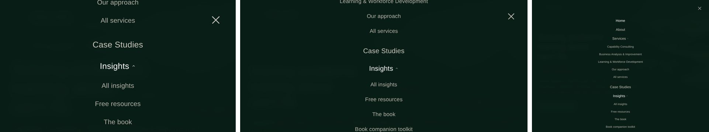

# 10 · Final remediation, optimisation and release QA

**Date:** 10 October 2026
**Status:** all changes are local and uncommitted, awaiting approval. Nothing has been committed, pushed or deployed.
**Builds on:** `09-qa-report.md` (QA-01 to QA-06 fixes, also still uncommitted).

---

## A. Content and UX changes

### A1. Homepage evidence: three case studies

The evidence section now shows exactly three cards, each with an evidence badge, a sector label, a title, the challenge, the contribution and a link.

| Card | Sector label | Badge | Link |
|---|---|---|---|
| MOD Digital Skills for Defence (DS4D), flagship and first | Defence · public sector | Founder-led experience | `mod-digital-skills-for-defence.html` |
| Healthcare Learning Transformation | Healthcare | Founder-led experience | `healthcare-learning-transformation.html` |
| Owner-led service business | Commercial · SME | Anonymised Prelude example | `case-studies.html#example-owner-led-service-business` (direct anchor) |

- The healthcare copy draws only on what the case-study page already says: around 15,000 colleagues, untrusted compliance data, Totara dashboards, role-based pathways and information management. It adds no new figures.
- The fine print under the cards now covers all three sources (founder roles and the anonymised Prelude engagement).
- **Layout:**
  - Above 1,000px the three cards sit in one row of equal columns: 300px each at 1,024, 348px at 1,180 and 365px at 1,440.
  - At 1,000px and below they stack one per row, so there is never a two-plus-one orphan on a tablet.
  - The badge and sector label now stack in every card, so the titles align across the row.
  - Overflow was checked at all eight widths, with none found.



### A2. Approved wording

| Requirement | Where | Result |
|---|---|---|
| "With specialist experience in Defence and public services, we work with organisations of every size and across every sector." | Homepage founder section (`.home-reach`) | Exact wording. It appears once on the homepage and nowhere else. |
| "The person you meet is the person accountable for the work. You'll work directly with an experienced practitioner who brings the expertise, ownership and commitment to see it through." | Homepage founder paragraph | Exact wording; it replaces the old sentence. |
| The same accountability wording | How I Work, "Senior delivery throughout" card | Updated so the two pages do not contradict each other. |

The phrase "the person who does the work" no longer appears anywhere on the site.

### A3. Mobile menu typography

**Root cause.** An unscoped desktop rule, `.nav-links a{font-size:13.5px}`, also applied inside the mobile overlay. The result was:

- top-level links (Home, About, Case Studies, Contact) rendered at 13.5px, while the Services and Insights buttons rendered at 20px;
- dropdown links shared the 13.5px size, so the hierarchy read backwards;
- `justify-content:center` on a scrolling column clipped "Home" off the top on short screens.

**Fix.** Two changes in `styles.css`:

- the desktop size is now scoped to `min-width:1181px`;
- one mobile block (≤1,180px) sets all values explicitly:
  - top-level items: 20px, weight 400, at least 48px tall;
  - sub-links: 16px, at least 44px tall;
  - CTA: 16px;
  - the column is top-aligned with auto margins, so it centres when it fits and scrolls from the top when it doesn't.

**Tested** at 320×568, 375×812, 390×844, 430×932, 768×1024, 1024×1366, 1180×820 and 1440×900 (desktop navigation), plus landscape at 568×320, 812×375, 844×390, 932×430, 1024×768 and 1180×768. At every size:

- top items measured 20px/400 and sub-links 16px;
- the smallest target was 44px;
- there was no horizontal overflow and no clipped first item;
- long labels such as "Learning & Workforce Development" fit at 320px.

QA-02 behaviour is unchanged: the first link takes focus when the menu opens, the page behind is inert, Escape closes the menu and returns focus to the burger, and resizing closes it.

Before (left) and after (centre and right) at 375px:



Portrait at 320, 390, 768 and 1,180px:



Landscape at 568×320, 844×390 and 1,024×768:



---

## B. QA items

### QA-07 Performance: fonts and hero image

**Problems**

1. **Render-blocking fonts.** The Fontshare stylesheet blocked rendering, costing about 780 ms on mobile in the 9 October Lighthouse run.
2. **General Sans never loaded (new finding).** The Fontshare API returns only the first family when `f[]` is repeated. The production request `f[]=satoshi@…&f[]=general-sans@…` therefore loaded Satoshi only. The body font has never loaded on the live site: visitors have seen a system font for body text. This was confirmed in the browser by requesting each order.
3. **Wasted weight.** Satoshi 900 was requested but is used nowhere.
4. **Hero image.** The background was a 100 KB JPEG with no preload, discovered only after the CSS loaded.

**Files changed:** `build.py` (`head()`, `page()`, homepage call), `styles.css`, plus a new `assets/brand/prelude-landscape-640.webp`.

**Changes: fonts**

- **One request per family:**
  - `satoshi@400,500,700` (900 dropped);
  - `general-sans@400,401,500,600,700`.

  These are the weights found in use by a computed-style audit of all 113 pages. Browsers download only the faces a page actually renders.
- **Non-blocking loading.** The stylesheets are injected by the existing inline head script, with a `<noscript>` fallback.
- **Preconnects:** `api.fontshare.com` (no `crossorigin`, since the CSS request is not CORS) and `cdn.fontshare.com` (with `crossorigin`, for the font files). The old preconnect wrongly used `crossorigin` for the CSS host, so the connection was never reused.
- **Metric-matched fallbacks.** These are new `@font-face` rules using `local('Arial')` or `local('Liberation Sans')`, with `size-adjust` and `ascent-override`/`descent-override` values measured in the browser against the real Satoshi and General Sans files. Text should move very little when the brand fonts arrive. `font-display:swap` is retained.

**Changes: hero image**

- **Formats:**
  - WebP at 1,055px (62 KB, an existing unused file) for desktop;
  - a new 640px WebP (26 KB) for ≤900px, where the image sits at 22% opacity;
  - the JPEG stays as the fallback through `image-set()`.
- **Preload.** Homepage-only `<link rel="preload" as="image" type="image/webp">`, split by the same 900px media query as the CSS, so exactly one file is fetched. This was tested: no double download and no unused-preload warning.
- **Appearance.** The CSS position, cover, opacity and mask are unchanged.

**Self-hosting assessment**

- The Fontshare ITF Free Font Licence (v2.0, read on fontshare.com) permits self-hosting the official font files on your own server via `@font-face`. It forbids modifying, converting or subsetting them, and redistributing them, including in public repositories. The repository is now private, so self-hosting is permitted.
- It was **not implemented**, because the official WOFF2 files could not be brought into the repository from this working environment without altering them. The fallback the brief allows for this case has been applied instead: keep the provider and optimise its loading.
- Self-hosting remains the recommended next step. It would remove the third-party connection entirely. See D3.

**Limitation.** Restoring General Sans is a visible change. Body text will render in the brand body font for the first time, slightly wider than the system font Mac visitors currently see. Every layout was checked for overflow, but this should be reviewed by eye on a preview deployment before release.

### QA-08 Heading order

**Problems**

- On CRR, the first section jumped from H1 to H3, because its label was a `div`.
- On Services, accordion panels jumped from H2 to H4.

**Files:** `build.py`, `styles.css`.

**Changes**

- **CRR:** the "What it is" label is now an `<h2 class="eyebrow">`. Its line-height and wrapping are reset, so it looks exactly as before.
- **Services:** each accordion button now sits inside an `<h3 class="acc-h">`, which is the WAI-ARIA accordion pattern. The H3 inherits all its type styles. Computed styles for the accordion buttons and eyebrows were compared before and after at 375 and 1,440px and are identical.

**Test result:** 0 heading skips across all 118 HTML files, and every page has exactly one H1.

### QA-09 Founder photo

**Problem.** One 803×1200 JPEG (157 KB) was served everywhere, including at 160px wide.

**Files:** `build.py` (new `founder_img()` helper), `styles.css`, plus four new WebP files.

**Changes**

- **Responsive WebP.** A `<picture>` with WebP at 320, 480, 640 and 803px (8 KB, 16 KB, 24 KB and 35 KB), with `sizes` set per context:
  - About page: full width below 1,000px, then 560px;
  - homepage, about strip and book page: 240px or 320px.
- **Fallback and loading.** The JPEG stays as the fallback `src`, with `width`/`height` 803×1200, `loading="lazy"` and `decoding="async"`, and no preload.
- **Layout.** `picture{display:contents}` and `source{display:none}` keep the existing flex and grid layouts intact. Rendered sizes match the previous build exactly at all seven widths tested.
- **Nested pages.** Every `srcset` candidate is now prefixed on nested pages, where previously only the first was.

**Test result.** Selection was verified:

| Viewport | Image chosen |
|---|---|
| Homepage, 1,440px at 1× | 320w WebP |
| Homepage, 1,440px at 2× | 640w WebP |
| Homepage, 768px at 2× | 480w WebP |
| About page, 375px at 3× | 803w WebP |

All 14 `srcset` candidates on disk resolve.

### QA-10 Language

**Change:** `<html lang="en-GB">` is now set in the shared `head()` template.

**Test result:** 118 of 118 HTML files use it. The toolkit error page generated by `api/toolkit-download.js` already did.

### QA-12 Content Security Policy (report-only)

**Inventory**

| Type | Found |
|---|---|
| Inline executable scripts | 2: the shared head script (113 pages) and the `thank-you.html` script |
| JSON-LD blocks | 383. These are data, not script, so CSP does not apply to them. |
| Inline event handlers | None |
| `eval` | None |
| Iframes | None |
| Third-party origins | Fontshare API (CSS), Fontshare CDN (fonts), Formspree (form posts and the resource dialog `fetch`) |
| Inline `style` attributes | Many, plus one `<noscript><style>` |

**Policy**, added to the existing `/(.*)` header block in `vercel.json` with all four existing headers preserved:

```
default-src 'self';
script-src 'self' 'sha256-…' 'sha256-…';
style-src 'self' 'unsafe-inline' https://api.fontshare.com;
font-src 'self' https://cdn.fontshare.com;
img-src 'self' data:;
connect-src 'self' https://formspree.io;
form-action 'self' https://formspree.io;
frame-ancestors 'self';
base-uri 'self';
object-src 'none'
```

- **Scripts** use hashes, with no `'unsafe-inline'` and no `'unsafe-eval'`.
- **Hashes stay in step automatically.** `build.py` now computes them from the generated pages on every build and writes them into `vercel.json`, so editing an inline script cannot silently break the policy.
- **Styles** need `'unsafe-inline'` because of the inline `style` attributes. Removing that is a later clean-up.
- **No wildcards.** `frame-ancestors 'self'` matches the existing `X-Frame-Options: SAMEORIGIN`.

**Reporting endpoint.** None exists, and none has been invented. Without one, violations appear only in the browser console of whoever loads the page. To collect reports later, add a `report-to`/`report-uri` endpoint you control.

**Test.** The policy was **enforced** locally: each HTML response was given the header by a Playwright proxy, and every `securitypolicyviolation` event and console report was recorded across:

- all 113 sitemap pages, plus the 404, thank-you and toolkit pages;
- the mobile menu, desktop dropdown and accordions;
- CRR scoring (63%, "Developing readiness");
- the resource dialog with a mocked Formspree, and its PDF download;
- the contact form submitted to a mocked Formspree, redirecting to `/thank-you.html`;
- the toolkit form posted to a mocked `/api/toolkit-access`, redirecting to the downloads page.

**Result: 0 violations.** A control test (a blocked inline script and a third-party image) produced the expected two violations, confirming the harness detects them.

**Limitation.** Vercel preview deployments inject a feedback toolbar script from `vercel.live`. Expect report-only console messages on previews; they are not production issues.

### QA-01 to QA-06: preserved

| Item | Re-test result |
|---|---|
| QA-01 link underlines | Breadcrumb and footer sector links are still underlined. |
| QA-02 menu focus | Focus moves to the first link on open; `main` is inert; Escape closes the menu and returns focus to the burger; the closed menu creates no off-screen tab stops at 375, 768 or 1,024px. |
| QA-03 no-JS content | With `script.js` blocked, 24 hidden elements become visible after 3 s; with JavaScript disabled, nothing is hidden; normal reveal animation is intact. |
| QA-04 `.vercelignore` | Present and unchanged. It is not live yet, so it must be re-checked after deployment (see D2). |
| QA-05 owner-led anchor | The anchor lands with its heading visible at 375 and 1,440px. |
| QA-06 contact errors | All four `aria-describedby` targets exist. |

### Also fixed

Smooth scrolling is now switched off when the visitor's system asks for reduced motion (`prefers-reduced-motion`). The reveal animations and the menu transition already respected that setting.

---

## C. Performance

**No new Lighthouse figures are reported.** Lighthouse needs a deployed URL; deploying needs your approval; and the local environment has no Lighthouse install and no access to the Fontshare servers. The figures below are a **local lab comparison** (Playwright and Chromium, not Lighthouse) of the committed version (what is live) against the candidate, under identical conditions:

| Setting | Mobile | Desktop |
|---|---|---|
| Latency | 150 ms | 40 ms |
| Bandwidth | 1.6 Mbps | 10 Mbps |
| CPU | 4× slowdown | No throttling |
| Simulated Fontshare stylesheet delay | 780 ms | 300 ms |

Each figure is the median of 5 runs.

| Metric | Live baseline (Lighthouse, 9 Oct) | Local lab: live code | Local lab: candidate | Target |
|---|---|---|---|---|
| Mobile performance score | 89 | n/a (not Lighthouse) | n/a (not Lighthouse) | 95+ |
| Mobile FCP | 2.8 s | 1.20 s | 1.13 s | — |
| Mobile LCP | 2.8 s | 1.84 s | 1.13 s | ≤ 2.5 s |
| Mobile CLS | 0 | 0.000 | 0.000 | ≤ 0.1 |
| Desktop performance score | 100 | n/a | n/a | 95+ |
| Desktop LCP | — | 0.58 s | 0.36 s | ≤ 2.5 s |
| Desktop CLS | 0.031 | 0.000 | 0.000 | ≤ 0.1 |
| Accessibility / Best practices / SEO | 96 / 100 / 100 | — | — | — |
| Homepage transfer (mobile) | — | 200 KB | 135 KB | — |

**Reading this table**

- **Absolute numbers are not comparable with Lighthouse.** Lighthouse uses different throttling, a different device profile and real third-party servers. Only the direction and size of the change between the two lab columns are meaningful.
- **What the lab shows.**
  - Mobile LCP fell by about 0.7 s, because the preloaded WebP hero now paints with the first frame.
  - First paint no longer waits for Fontshare.
  - Mobile transfer fell by about a third.
- **What it cannot show.** The lab could not load the real font files, so it cannot measure any layout shift when the brand fonts swap in. The metric-matched fallbacks are designed to keep that small, but CLS must be confirmed on a real deployment.

**Required after approval: three mobile Lighthouse runs**

1. Deploy to a **Vercel preview** first, not production.
2. Run PageSpeed Insights (mobile) three times on the preview URL.
3. Record each run and the median here: score, FCP, LCP, CLS, TBT and SI.
4. Repeat on production after release.

| Run | Score | FCP | LCP | CLS | TBT | SI |
|---|---|---|---|---|---|---|
| 1 | | | | | | |
| 2 | | | | | | |
| 3 | | | | | | |
| **Median** | | | | | | |

---

## D. Release readiness

### D1. Regression summary (local)

| Check | Result |
|---|---|
| Overflow, one H1, console errors | 33 pages × 8 widths (320, 375, 390, 430, 768, 1,024, 1,180, 1,440): **no issues** |
| Internal links | 5,552 checked. **No broken links.** Excluded from the result: one checker false positive (a multi-candidate `srcset`; all 14 candidates verified separately) and the toolkit API routes, which exist only on Vercel. |
| Heading order | 0 skips in 118 files |
| Metadata | Titles, descriptions, canonicals, OG title and image, and robots are **unchanged** against the last commit on every page |
| JSON-LD | 383 blocks parse |
| Sitemap and robots | Sitemap URL set unchanged (110 URLs); `robots.txt` unchanged |
| `lang="en-GB"` | 118 of 118 files |
| Case-study links | DS4D, Healthcare and the owner-led anchor all resolve |
| Mobile menu | 14 viewports, consistent type, no clipping (A3) |
| Keyboard | Skip link, menu focus handling and Escape all pass (QA-02) |
| Reduced motion | No hidden content, menu transition 0 s, smooth scroll now off |
| Contact form | Mocked submit lands on the thank-you page; nothing was sent to the live endpoint |
| Resource dialog and downloads | Mocked submit succeeds; PDF downloads |
| CRR | Scoring correct |
| Toolkit | Form flow tested with a mocked API. Live protection is unchanged in code; live checks on 9 October showed both endpoints redirect without the cookie. |
| CSP (enforced locally) | 0 violations |
| Colour contrast (menu) | Stone 10.2:1, stone-dim 8.3:1 and gold 7.8:1 on forest |

**axe-core.** axe could not be run against the *local* build, because the CDN is blocked in this environment. It previously ran on the live pages in the browser. Run it again on the preview deployment. The changed markup follows established patterns (a heading wrapping a button, an eyebrow H2, `picture` and `img` with alt text), and the static accessibility checks found nothing new. The only flag was the existing CRR radio false positive: those radios are labelled by their wrapping `<label>`.

### D2. Release checklist (needs your approval)

1. Review the visual change to body text (General Sans now loads) on a **Vercel preview**.
2. Run the three Lighthouse mobile tests and axe on the preview, and record them in section C.
3. In the browser console on the preview, check for CSP report-only messages; ignore any from `vercel.live`.
4. Commit the uncommitted QA-01 to QA-06 changes together with this round, then push.
5. After production deploys, check that these return 404:
   - `/docs/09-qa-report.md`
   - `/build.py`
   - `/AUDIT.md`
   - `/resources-src/`

   This confirms `.vercelignore` is working.
6. After about a week with no unexpected CSP messages, consider switching to an enforcing `Content-Security-Policy`. This is not done yet, as instructed.

### D3. Recommended next steps (not done)

| Item | Benefit | Dependency |
|---|---|---|
| Self-host the official Satoshi and General Sans WOFF2 files, unmodified, in `assets/fonts/`, with `@font-face`, preloading only Satoshi 500 and General Sans 400, plus a long cache header | Removes both third-party connections and lets the CSP drop the Fontshare hosts | Download the files from fontshare.com on your Mac and place them in the repo. The repo must stay private, as the licence forbids redistribution. |
| Replace inline `style=""` attributes with classes | Lets `style-src` drop `'unsafe-inline'` | Template clean-up (C4) |
| A CSP reporting endpoint | Central visibility of violations | A service you control |

### D4. Risks

| Risk | Likelihood | Mitigation |
|---|---|---|
| General Sans changes line lengths | Certain, minor | Overflow tested; review on preview |
| Font-swap layout shift on slow connections | Low | Metric-matched fallbacks; confirm CLS on preview |
| Report-only CSP noise | Low | Report-only cannot break anything |

---

## E. Git status

- **Repository:** `prelude-website-v2` on your Mac. Remote `origin` is `https://github.com/w88tcvthhp-sudo/prelude-learning-Consultancy.git` (private).
- **Branch:** `main`. The last commit is the final homepage refinements; it has not moved.
- **Uncommitted:** the QA-01 to QA-06 fixes (9 October) and this round's changes. The working tree is listed in the hand-over message.
- **Nothing committed, pushed or deployed.** The ~200 untracked iCloud duplicates ("… 2.html") are still in the Mac folder and must not be added.

### New files in this round

- `assets/brand/prelude-landscape-640.webp`
- `assets/photos/professional-photograph-of-jason-smith-{320,480,640,803}.webp`
- `docs/10-final-remediation-report.md`
- `docs/qa-2026-10-10/` (six screenshots)

### Modified in this round

- `build.py`
- `styles.css`
- `vercel.json`
- every generated HTML page (`lang`, head and fonts)
- `index.html`, `about.html`, `services.html`, `capability-readiness-review.html`, `how-i-work.html` and `training-isnt-always-the-answer/index.html` (content and markup)
- `docs/02-remediation-backlog.md`
- `docs/07-change-log.md`
